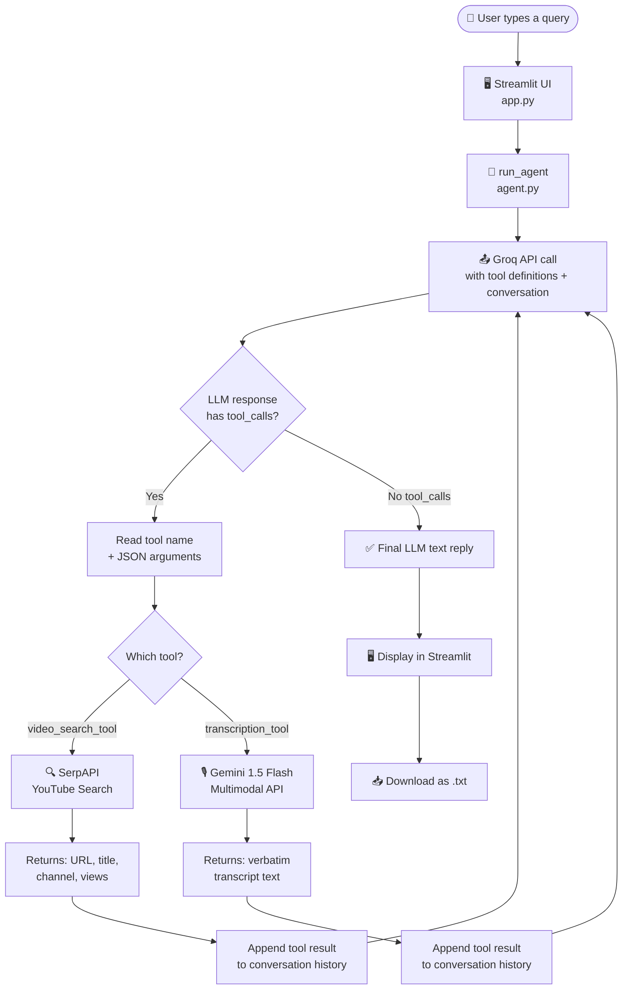
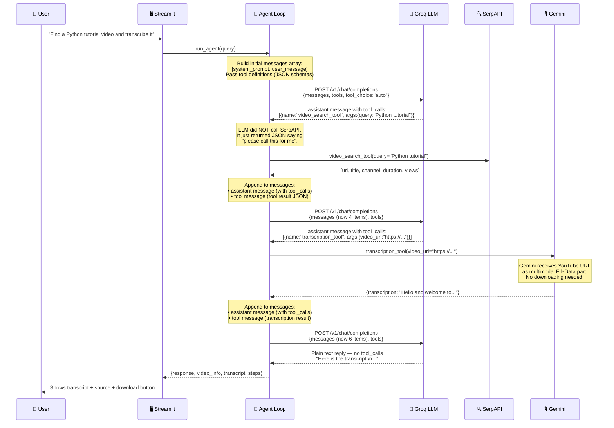

# 🎬 AI Video Search & Transcription Agent

An **agentic AI system** that:
1. Accepts a natural-language query from the user
2. Autonomously calls tools to **find a YouTube video** (SerpAPI) and **transcribe it** (Gemini)
3. Returns the verbatim transcript + video source, with a downloadable `.txt` file

Built with **Groq (LLaMA 3.3-70B)** · **SerpAPI** · **Gemini 1.5 Flash** · **Streamlit**

---

## 🔑 Setup

```bash
# 1. Clone / download the project
cd video_agent

# 2. Install dependencies
pip install -r requirements.txt

# 3. Set up API keys
cp .env.example .env
# Edit .env and paste your keys

# 4. Run
streamlit run app.py
```

### API keys you need

| Key | Where to get it |
|-----|----------------|
| `GROQ_API_KEY` | https://console.groq.com/keys |
| `GEMINI_API_KEY` | https://aistudio.google.com/app/apikey |
| `SERPAPI_KEY` | https://serpapi.com/manage-api-key |

---

## 🗂️ Project Structure

```
video_agent/
├── app.py            ← Streamlit UI
├── agent.py          ← AI agent + tool-calling loop (Groq)
├── tools.py          ← Tool implementations (SerpAPI + Gemini)
├── requirements.txt
├── .env.example      ← Copy to .env and fill in your keys
└── README.md         ← You are here
```

---

## 🔧 How Tool Calling Works — Under the Hood

> **Common misconception:** "The LLM calls the tools."
>
> **Reality:** The LLM *outputs a structured JSON request* saying *"I want to call this function with these arguments."* Your **application code** reads that JSON, executes the real Python function, and feeds the result back to the LLM.

### High-Level Flow



---

### Detailed Tool-Calling Sequence (Message-Level)

This is exactly what goes into and out of the Groq API on each loop iteration.



---

### What Each File Does

#### `tools.py` — The Real Workers

| Function | API Called | What it does |
|----------|-----------|-------------|
| `video_search_tool(query)` | SerpAPI `/search?engine=youtube` | Returns top YouTube result: URL, title, channel |
| `transcription_tool(video_url)` | Gemini 1.5 Flash | Passes YouTube URL as `FileData(file_uri=...)`, returns verbatim transcript |

```python
# Gemini accepts YouTube URLs natively — no video download needed
video_part = genai.protos.Part(
    file_data=genai.protos.FileData(
        file_uri=video_url,   # ← full YouTube URL goes here
        mime_type="video/*",
    )
)
response = model.generate_content([video_part, "Transcribe this video..."])
```

#### `agent.py` — The Orchestrator

```python
# Tool definitions tell the LLM WHAT tools exist and their parameter schemas
TOOL_DEFINITIONS = [
    {"type": "function", "function": {"name": "video_search_tool", ...}},
    {"type": "function", "function": {"name": "transcription_tool", ...}},
]

# The agentic loop
while True:
    response = groq_client.chat.completions.create(
        model="llama-3.3-70b-versatile",
        messages=messages,          # full conversation history
        tools=TOOL_DEFINITIONS,
    )
    if response has tool_calls:
        execute tools → append results to messages → loop again
    else:
        return final answer          # LLM decided it's done
```

#### `app.py` — The Interface

- Text input for user query
- Live `st.status` panel showing each agent step in real time
- Video metadata card (title, channel, duration, views)
- Scrollable transcript box
- Download button (`transcript_YYYYMMDD_HHMMSS.txt`)
- Tool call log with expandable JSON for each step

---

## 🧩 Why Use an Agent Instead of Hardcoding the Steps?

In this project the two steps (search → transcribe) are fixed, so you *could* hardcode them. But the agent pattern gives you:

- **Flexibility** — add more tools (summarise, translate, sentiment) without changing control flow
- **Error recovery** — the LLM can retry or pick a different video if one step fails
- **Natural language routing** — the agent can decide to skip transcription if the user only asked for the URL

---

## 📦 Dependencies

| Package | Purpose |
|---------|---------|
| `groq` | Groq SDK — LLaMA 3.3-70B for the agent |
| `google-generativeai` | Gemini 1.5 Flash for video transcription |
| `streamlit` | Web UI |
| `requests` | HTTP calls to SerpAPI |
| `python-dotenv` | Load `.env` API keys |

---

## ⚠️ Notes

- **Video length:** Gemini 1.5 Flash supports up to ~1 hour of video. Very long videos may hit token limits — prefer shorter clips.
- **SerpAPI free tier:** 100 searches/month. Upgrade for production use.
- **Groq rate limits:** LLaMA 3.3-70B has generous free-tier limits; check https://console.groq.com for current quotas.
- **Private/age-gated videos:** Gemini cannot transcribe YouTube videos that require login.
