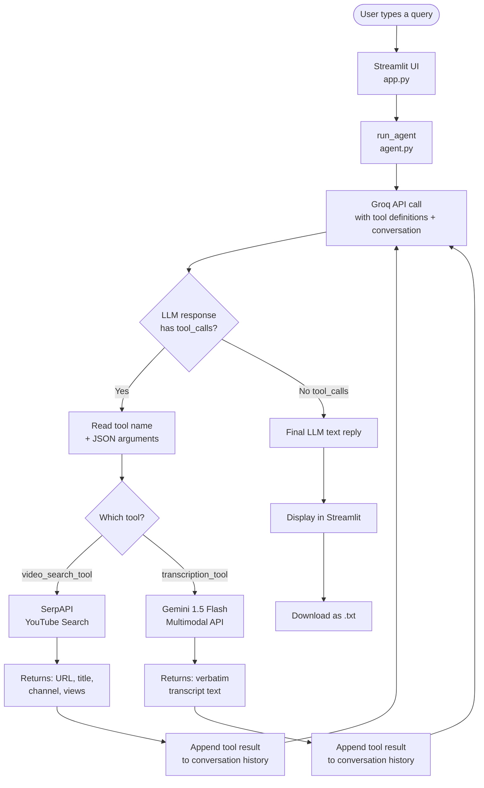

# AI Video Search & Transcription Agent

An agentic AI system that takes a natural-language prompt, finds a relevant YouTube video, and transcribes it verbatim — all driven by tool-calling under the hood.

**Stack:** Groq (LLaMA 3.3-70B) · SerpAPI · Gemini 3.5 Flash · yt-dlp · Streamlit

---

## Project Structure

```
Tool_Calling/
│
├── app.py               ← Streamlit UI (entry point)
├── agent.py             ← Groq agent loop + tool-calling logic
├── tools.py             ← VideoSearchTool + TranscriptionTool
│
├── .env                 ← your API keys (never commit this)
├── .env.example         ← template to copy from
├── .gitignore
├── requirements.txt
│
└── transcripts/         ← auto-created on first run
    └── <video_id>.txt   ← saved transcript per video
```

---

## Setup

```bash
# 1. Install dependencies
pip install -r requirements.txt

# 2. Add your API keys
cp .env.example .env
# Open .env and fill in the three keys

# 3. Run
streamlit run app.py
```

### API Keys

| Key | Where to get it |
|-----|----------------|
| `GROQ_API_KEY` | https://console.groq.com/keys |
| `GEMINI_API_KEY` | https://aistudio.google.com/app/apikey |
| `SERPAPI_KEY` | https://serpapi.com/manage-api-key |

---

## How It Works — Full Workflow

```
graph TD
    User([User Prompt]) --> Agent{AI Agent app.py / agent.py}
    Agent -- 1. Search Query --> Tool1[VideoSearchTool]
    Tool1 -- SerpApi YouTube Engine --> YouTubeURL[YouTube URL]
    YouTubeURL --> Agent
    Agent -- 2. Video URL --> Tool2[TranscriptionTool]
    Tool2 -- yt-dlp --> LocalAudio[Local M4A Audio]
    LocalAudio -- Files Upload --> GeminiFiles[Gemini Files API]
    GeminiFiles -- Multimodal Speech-to-Text --> TranscriptText[Transcript Text]
    TranscriptText -- Save File --> FileSystem[transcripts/video_id.txt]
    FileSystem --> Tool2
    Tool2 --> Agent
    Agent --> UserFinal[Agent Final Reply & Video Embed]
```

### Step by step

1. User types a topic into the Streamlit UI
2. Groq LLM agent receives the prompt and decides to call `video_search_tool`
3. SerpAPI queries the YouTube engine and returns the top result (URL, title, channel)
4. Agent receives the URL and calls `transcription_tool`
5. `yt-dlp` downloads the best available non-DASH audio (`m4a` → `webm` → fallback)
6. Audio file is uploaded to the Gemini Files API
7. Gemini transcribes the audio verbatim using the model fallback chain
8. Transcript is saved to `transcripts/<video_id>.txt`
9. Agent returns the raw transcript text to Streamlit
10. UI shows the video embed, transcript, metadata, and a download button

---
### High-Level Flow



---


## 📦 Dependencies

| Package | Purpose |
|---------|---------|
| `groq` | Groq SDK — LLaMA 3.3-70B for the agent |
| `google-generativeai` | Gemini 3.5 Flash for video transcription |
| `streamlit` | Web UI |
| `requests` | HTTP calls to SerpAPI |
| `python-dotenv` | Load `.env` API keys |

---
## How Tool Calling Works Under the Hood

A common misconception is that "the LLM calls the tools." In reality, the LLM outputs a structured JSON request and **your application code** executes the actual functions.

### Actual message flow (what goes into the Groq API)

```
Call 1 →  [system, user]
           LLM responds: tool_calls → video_search_tool

Call 2 →  [system, user, assistant(tool_calls), tool(search result)]
           LLM responds: tool_calls → transcription_tool

Call 3 →  [system, user, assistant, tool, assistant(tool_calls), tool(transcript)]
           LLM responds: plain text → DONE
```

The LLM never executes code. It only reads results that your code ran and appended.

---

##  Notes

- **Private or age-gated videos** cannot be downloaded by yt-dlp without providing cookies
- **SerpAPI free tier** allows 100 searches/month — upgrade for production use
- **Gemini Files API** auto-deletes uploaded files after 48 hours; the tool also deletes them immediately after transcription in the `finally` block
- `transcripts/` folder is created automatically on first run — no manual setup needed
- The `.env` file is in `.gitignore` — your keys will never be accidentally committed

- **Groq rate limits:** LLaMA 3.3-70B has generous free-tier limits; check https://console.groq.com for current quotas.
- **Private/age-gated videos:** Gemini cannot transcribe YouTube videos that require login.
